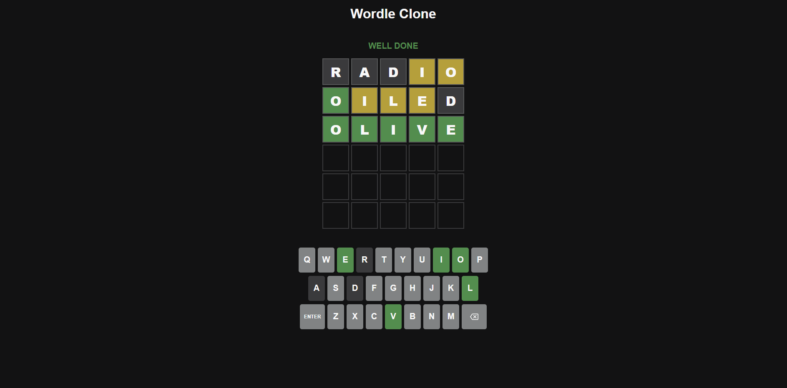

# Wordle Clone in React

Welcome to my Wordle Clone project! This is a fully functional Wordle game clone which replicates most, if not all, of its classic features. This project was built for a [tutorial on my YouTube channel](https://youtu.be/YmRS04CLarY).

This Wordle Clone features:

- 🎲 Random Solution Generator
- ✨ Cool Reveal and Typing Animations
- 📬 Interactive Notification Messages
- 🧩 Comprehensive Word Interaction Functionalities

Users can seamlessly:

- 🖋 Enter, Submit, and Delete Words
- ⌨️ Enjoy a Functional Virtual Keyboard

The application intelligently marks tried letters as:

- ❌ Absent
- ➡️ Present
- ✔️ Correct

# Usage

Feel free to clone this repo and use it as a backup while going through the tutorial, or expand it to build an even better Wordle clone.

To start the project run `yarn` and `yarn dev` in your repo folder.
